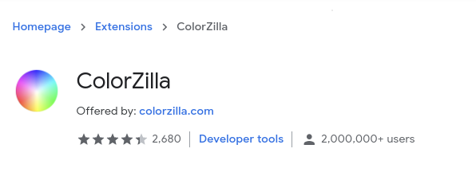
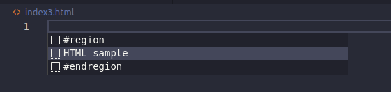
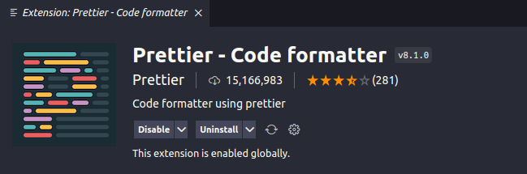
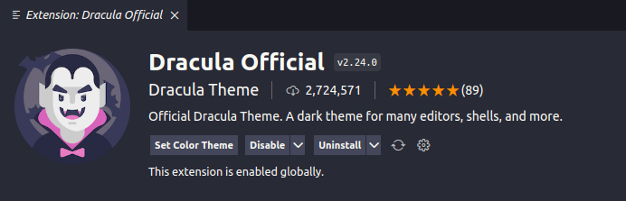
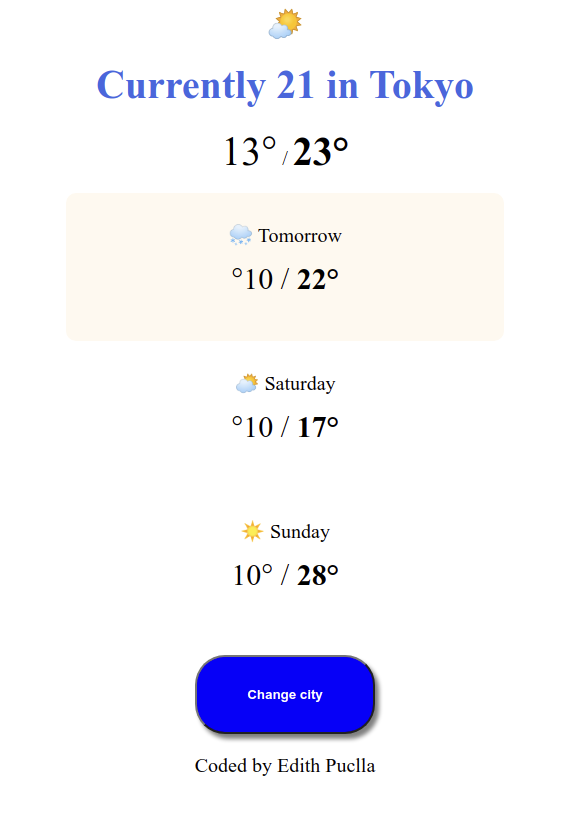
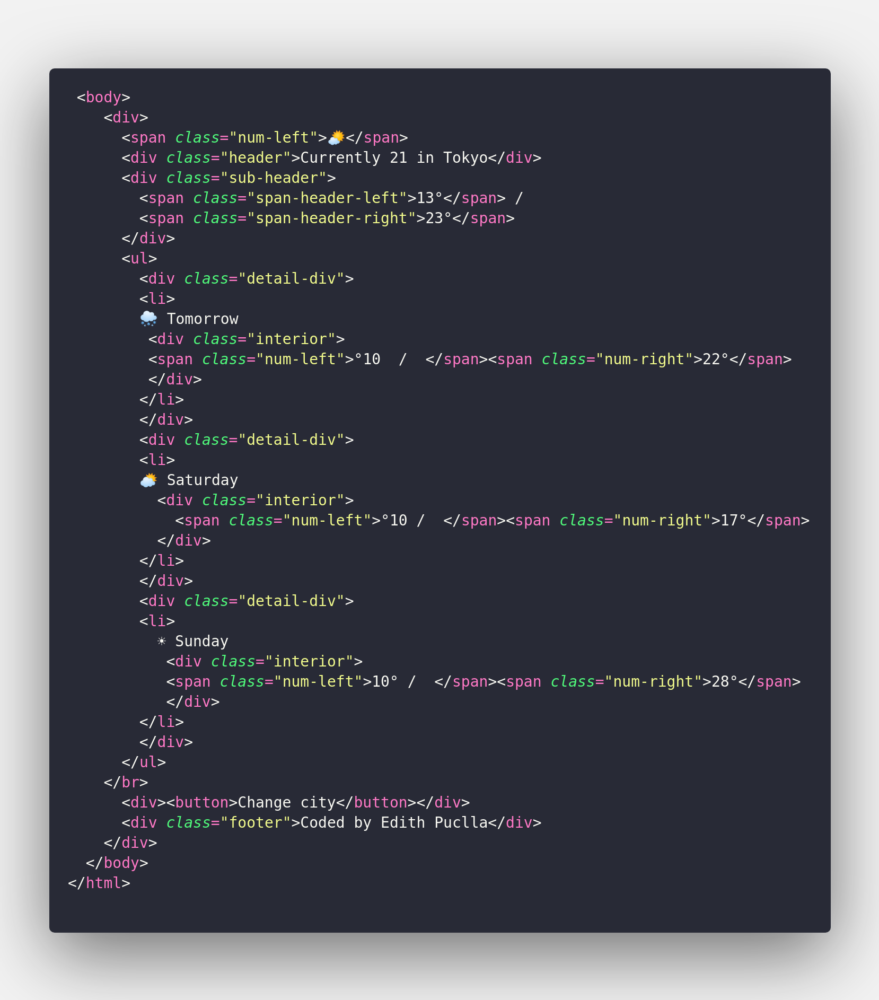

# SheCode Basics

## **Weekly summary 01** | HTML and CSS

```html
<!-- Html Elements -->

<!-- Titles -->

<h1></h1>
<h2></h2>
<h3></h3>
<h4></h4>
<h5></h5>

<!-- paragraphs -->

<p>Hello World!</p>

<!-- Lists -->

<ul>
  <li>Element one</li>
  <li>Element two</li>
</ul>

<ol>
  <li>Number one</li>
  <li>Number two</li>
</ol>

<!-- Styling -->

<em>Hello world italic!</em> <strong>Hello world bold!</strong>

<!-- Self closing Tags -->

<hr />
<br />
```

## Developer Tools

ColorZilla chrome extension

<p align="center">
  
</p>

ctrl + Space Bar -> To HTML sample, to get the HTML template

<p align="center">
  
</p>

Prettier extention for Visual Studio Code

<p align="center">
  
</p>

Visual Studio Code theme: Dracula or https://vscodethemes.com/

<p align="center">
  
</p>

## Homework Workshop Week 01

 
